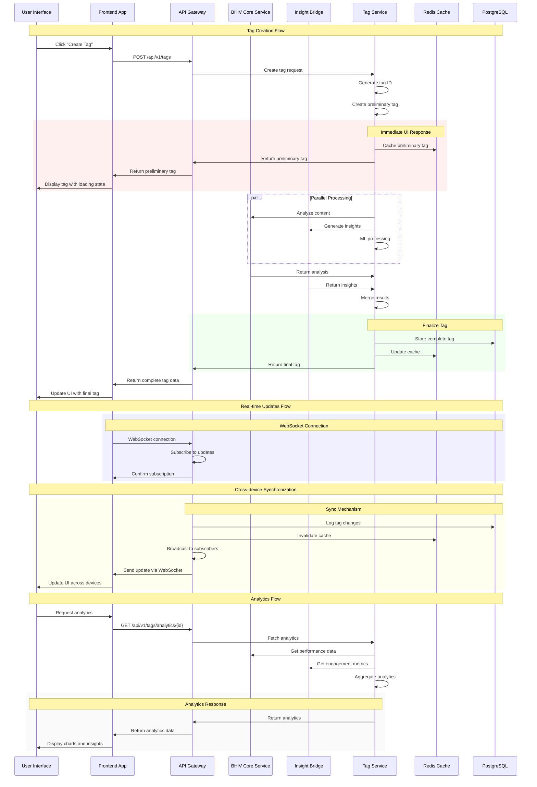
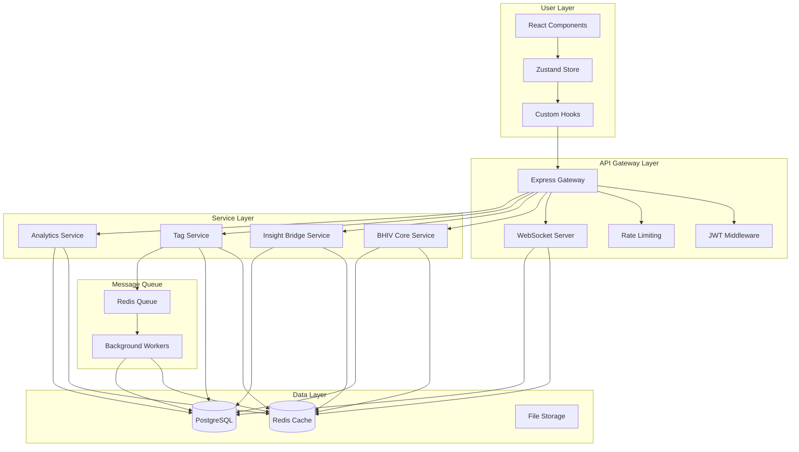
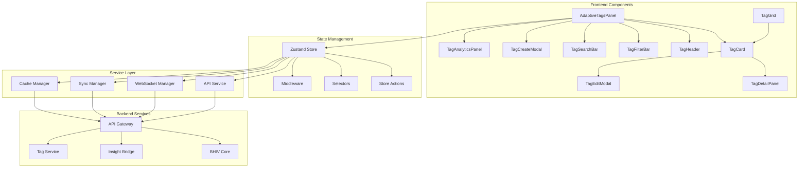
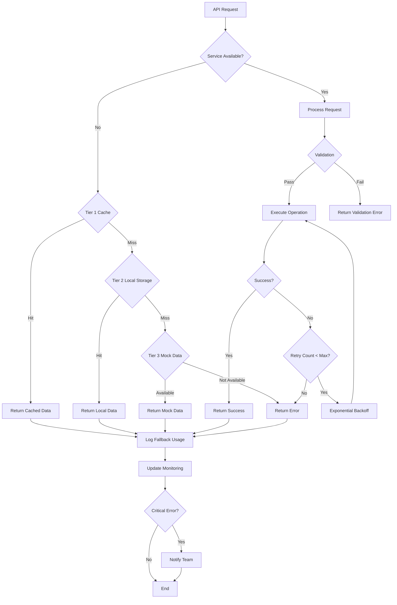
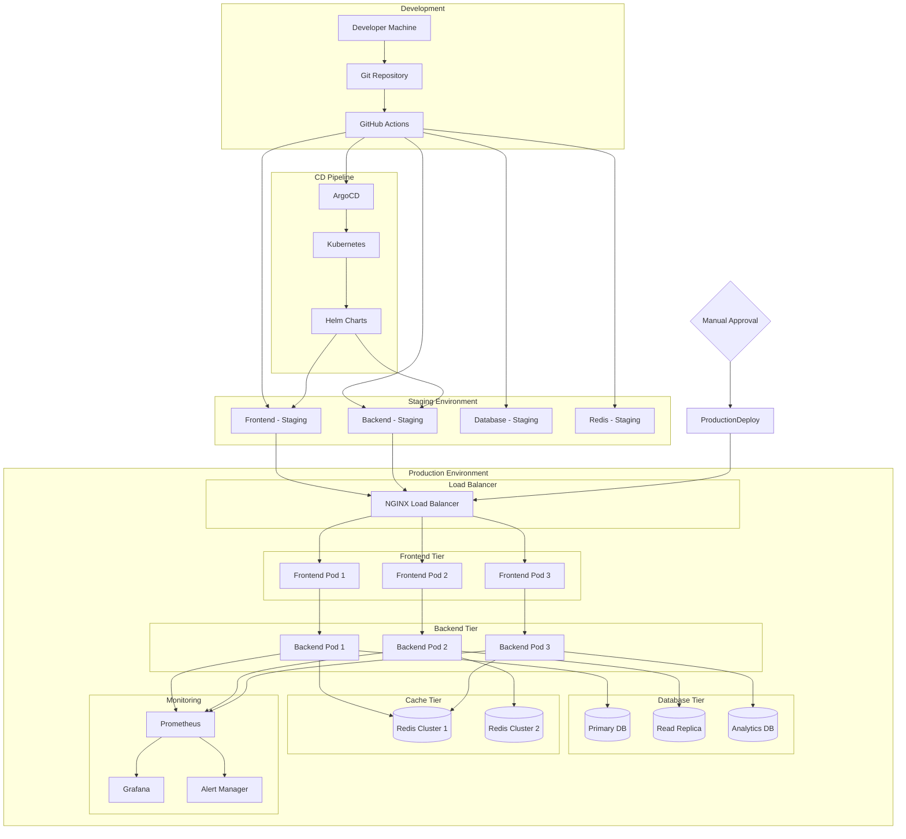
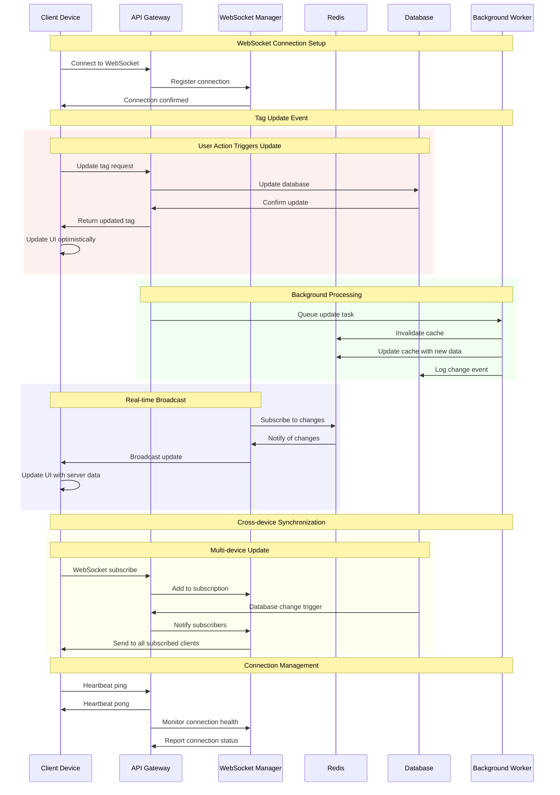

# Adaptive Tags End-to-End Flow Diagram

## Complete Integration Flow

## Data Flow Architecture

## Component Architecture

## Error Handling Flow

## Deployment Architecture

## Testing Strategy Flow

```mermaid
graph LR
    subgraph "Development Phase"
        Unit[Unit Tests]
        Lint[Code Linting]
        Type[Type Checking]
        Build[Build Process]
    end
    
    subgraph "CI Pipeline"
        Test[Run Tests]
        Coverage[Coverage Check]
        Security[Security Scan]
        Quality[Quality Gates]
    end
    
    subgraph "Integration Testing"
        API[API Integration]
        DB[Database Tests]
        Cache[Cache Tests]
        External[External Services]
    end
    
    subgraph "E2E Testing"
        Cypress[Cypress Tests]
        Playwright[Playwright Tests]
        Visual[Visual Regression]
        Accessibility[Accessibility Tests]
    end
    
    subgraph "Performance Testing"
        Load[Load Tests]
        Stress[Stress Tests]
        JMeter[JMeter Tests]
        Artillery[Artillery Tests]
    end
    
    subgraph "Security Testing"
        SAST[Static Analysis]
        DAST[Dynamic Analysis]
        Dependency[Dependency Scan]
        Penetration[Penetration Tests]
    end
    
    Unit --> Lint
    Lint --> Type
    Type --> Build
    Build --> Test
    
    Test --> Coverage
    Coverage --> Security
    Security --> Quality
    Quality --> API
    
    API --> DB
    DB --> Cache
    Cache --> External
    External --> Cypress
    
    Cypress --> Playwright
    Playwright --> Visual
    Visual --> Accessibility
    Accessibility --> Load
    
    Load --> Stress
    Stress --> JMeter
    JMeter --> Artillery
    Artillery --> SAST
    
    SAST --> DAST
    DAST --> Dependency
    Dependency --> Penetration
    Penetration --> Deploy
```

## Real-time Update Flow

This comprehensive set of diagrams illustrates the complete end-to-end flow for the Adaptive Tags system, showing:

1. **Tag Creation Flow**: From user interaction to final tag display
2. **Data Flow Architecture**: How data moves through the system layers
3. **Component Architecture**: Frontend component relationships and state management
4. **Error Handling Flow**: Multi-tier fallback system and error recovery
5. **Deployment Architecture**: Complete infrastructure from development to production
6. **Testing Strategy Flow**: Comprehensive testing approach across all layers
7. **Real-time Update Flow**: WebSocket connections and cross-device synchronization

These diagrams provide a visual representation of the complex integration between BHIV Core Service, Insight Bridge Component, and the Frontend Application, demonstrating how the system achieves real-time tag lifecycle management, dynamic content analysis, and synchronized tag state across devices and sessions.
