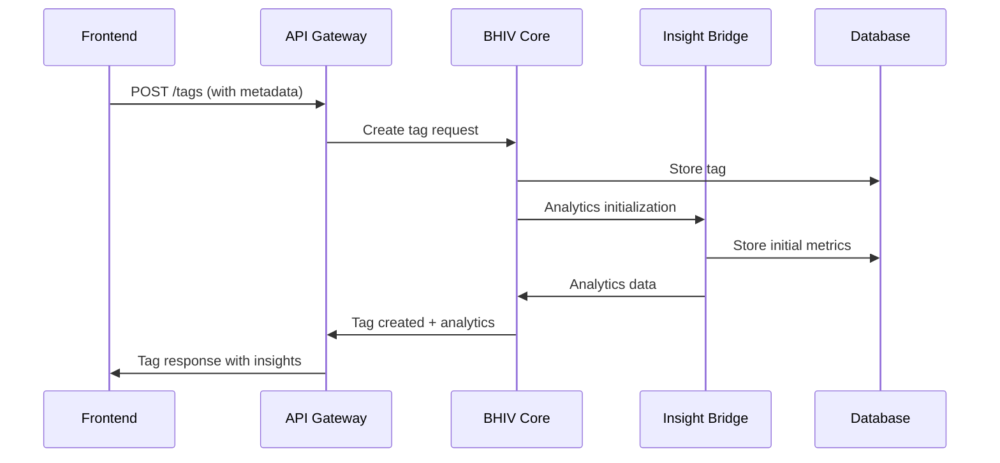
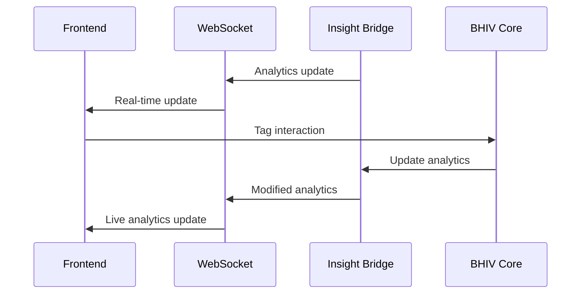

# Adaptive Tag System Architecture

## System Overview

The Adaptive Tag system is a real-time, intelligent tagging solution that integrates BHIV core service, Insight Bridge analytics, and a modern React-based frontend. The system enables dynamic tag behavior that adapts based on user interactions, system analytics, and cross-device synchronization.

## Architecture Components

### 1. BHIV Core Service
- **Purpose**: Handles business logic and tag lifecycle management
- **Technology**: Node.js/Express with TypeScript
- **Key Features**:
  - Tag CRUD operations
  - Tag state management
  - Tag versioning and rollback
  - Business rule enforcement
  - Audit logging

### 2. Insight Bridge Component
- **Purpose**: Provides real-time insights and analytics for tags
- **Technology**: Python with FastAPI
- **Key Features**:
  - Real-time analytics processing
  - Tag performance metrics
  - User behavior analysis
  - Predictive tag recommendations
  - Cross-session analytics

### 3. Frontend Application
- **Purpose**: React-based SPA for tag interaction and management
- **Technology**: React 18, TypeScript, Vite
- **Key Features**:
  - Adaptive tag rendering
  - Real-time updates via WebSocket
  - Responsive design
  - Cross-device synchronization
  - Interactive tag management

## Core Integration Patterns

### 1. Event-Driven Architecture
```
Frontend -> BHIV Core -> Insight Bridge -> Frontend
    ↑                                    ↓
    ←← Real-time WebSocket updates ←←
```

### 2. State Synchronization
- **Local State**: React useState/useReducer for component state
- **Server State**: Zustand store for application-wide state
- **Real-time State**: WebSocket for live updates
- **Persistent State**: localStorage for offline capability

### 3. Data Flow Architecture

#### Primary Flow: Tag Creation


#### Real-time Update Flow


## Technical Stack Details

### Backend Services

#### BHIV Core Service (`server/`)
- **Framework**: Express.js with TypeScript
- **Database**: PostgreSQL with Prisma ORM
- **Authentication**: JWT tokens with refresh mechanism
- **Caching**: Redis for session and tag data
- **Message Queue**: Redis for async processing

#### Insight Bridge Component (`insightbridge-phase3/`)
- **Framework**: FastAPI with Python 3.11
- **Database**: PostgreSQL for analytics data
- **Cache**: Redis for real-time metrics
- **Machine Learning**: scikit-learn for predictions
- **Real-time**: WebSocket connections

### Frontend Application (`src/`)
- **Framework**: React 18 with TypeScript
- **Build Tool**: Vite
- **State Management**: Zustand
- **Styling**: Tailwind CSS
- **Real-time**: Socket.IO client
- **Testing**: Vitest + React Testing Library

## Security Architecture

### 1. Authentication Flow
```
Frontend -> API Gateway -> BHIV Core -> JWT Validation
     ↓                              ↓
     ←← Bearer Token ←← ←← Access Token ←←
```

### 2. Authorization Matrix
| Resource | Frontend User | Admin | System |
|----------|---------------|-------|---------|
| View Tags | ✓ | ✓ | ✓ |
| Create Tags | ✓ | ✓ | ✓ |
| Modify Tags | ✓ | ✓ | ✓ |
| Delete Tags | - | ✓ | ✓ |
| Analytics Access | ✓ | ✓ | ✓ |
| System Config | - | ✓ | ✓ |

### 3. Data Protection
- **Encryption**: AES-256 for sensitive data
- **Transport**: TLS 1.3 for all communications
- **Storage**: Encrypted database fields
- **API**: Rate limiting and input validation

## Scalability Design

### 1. Horizontal Scaling
- **Load Balancer**: NGINX for API routing
- **Service Instances**: Multiple BHIV and Insight Bridge instances
- **Database**: Read replicas and sharding
- **Cache**: Distributed Redis cluster

### 2. Performance Optimization
- **CDN**: Static asset delivery
- **Caching**: Multi-layer caching strategy
- **Database**: Query optimization and indexing
- **API**: Response compression and pagination

### 3. Monitoring & Observability
- **Metrics**: Prometheus + Grafana
- **Logging**: ELK Stack (Elasticsearch, Logstash, Kibana)
- **Tracing**: Jaeger for distributed tracing
- **Health Checks**: Automated service monitoring

## Deployment Architecture

### 1. Container Strategy
```yaml
# docker-compose structure
services:
  frontend:
    build: ./frontend
    ports: ["3000:3000"]
  
  bhiv-core:
    build: ./server
    ports: ["8001:8001"]
  
  insight-bridge:
    build: ./insightbridge-phase3
    ports: ["8002:8002"]
  
  postgres:
    image: postgres:15
    environment:
      POSTGRES_DB: adaptive_tags
  
  redis:
    image: redis:7-alpine
  
  nginx:
    image: nginx:alpine
    ports: ["80:80", "443:443"]
```

### 2. CI/CD Pipeline
```yaml
# .github/workflows/deploy.yml
stages:
  1. Code Quality
     - ESLint, Prettier
     - TypeScript compilation
     - Security scanning
  
  2. Testing
     - Unit tests
     - Integration tests
     - E2E tests
  
  3. Build & Package
     - Docker image creation
     - Security vulnerability scanning
  
  4. Deployment
     - Staging deployment
     - Automated testing
     - Production deployment
```

## Integration Points

### 1. BHIV Core ↔ Insight Bridge
- **Protocol**: REST API + WebSocket
- **Authentication**: Service-to-service JWT
- **Data Format**: JSON with versioning
- **Error Handling**: Circuit breaker pattern

### 2. Frontend ↔ Backend Services
- **API Gateway**: Centralized routing and authentication
- **WebSocket**: Real-time bidirectional communication
- **REST APIs**: CRUD operations and queries
- **Authentication**: JWT tokens with refresh

### 3. Cross-Service Communication
- **Event Bus**: Redis Pub/Sub for decoupled communication
- **Service Discovery**: Consul or etcd
- **Configuration**: Centralized config management
- **Secrets**: HashiCorp Vault integration

## Quality Assurance

### 1. Testing Strategy
- **Unit Tests**: 90%+ coverage requirement
- **Integration Tests**: API and service integration
- **E2E Tests**: Full user workflow validation
- **Performance Tests**: Load and stress testing
- **Security Tests**: Vulnerability and penetration testing

### 2. Code Quality
- **Linting**: ESLint + Prettier
- **Type Safety**: TypeScript strict mode
- **Code Review**: Mandatory peer review process
- **Documentation**: Comprehensive API and code docs

### 3. Monitoring & Alerting
- **Uptime Monitoring**: 99.9% availability target
- **Performance Monitoring**: Sub-200ms API response times
- **Error Tracking**: Real-time error alerting
- **User Experience**: Performance and usability metrics

This architecture provides a robust, scalable foundation for the Adaptive Tag system with comprehensive integration between all components.