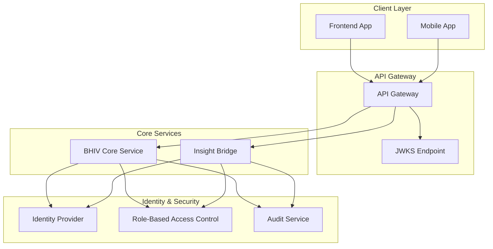

# Authentication and Authorization Mechanisms

## Overview

This document specifies the comprehensive authentication and authorization mechanisms for the Adaptive Tag system, ensuring secure access across BHIV Core Service, Insight Bridge, and the Frontend Application.

## System Architecture

### Authentication Flow Components



## Authentication Mechanisms

### 1. JWT-Based Authentication

#### Token Structure

```typescript
interface JWTPayload {
  // Standard Claims
  iss: string;           // Issuer: "bhiv-auth-service"
  sub: string;           // Subject: User ID or Service ID
  aud: string;           // Audience: Specific service or "bhiv-platform"
  exp: number;           // Expiration timestamp
  nbf: number;           // Not before timestamp
  iat: number;           // Issued at timestamp
  jti: string;           // JWT ID for revocation
  
  // Custom Claims
  role: UserRole;        // User role in the system
  permissions: string[]; // Specific permissions
  tenant_id: string;     // Multi-tenant identifier
  session_id: string;    // Session identifier
  device_id: string;     // Device fingerprint
  context: UserContext;  // Additional context data
}

enum UserRole {
  ADMIN = "admin",
  DEVELOPER = "developer", 
  CONTENT_MANAGER = "content_manager",
  VIEWER = "viewer",
  SYSTEM = "system"
}

interface UserContext {
  user_agent: string;
  ip_address: string;
  geographic_region?: string;
  security_level: SecurityLevel;
}
```

#### Frontend Implementation

```typescript
// AuthService.ts
class AuthService {
  private static instance: AuthService;
  private tokenStore: TokenStore;
  private refreshPromise: Promise<string> | null = null;
  
  static getInstance(): AuthService {
    if (!AuthService.instance) {
      AuthService.instance = new AuthService();
    }
    return AuthService.instance;
  }
  
  async authenticate(credentials: LoginCredentials): Promise<AuthResult> {
    try {
      const response = await fetch('/api/auth/login', {
        method: 'POST',
        headers: { 'Content-Type': 'application/json' },
        body: JSON.stringify(credentials)
      });
      
      if (!response.ok) {
        throw new AuthenticationError('Login failed');
      }
      
      const { access_token, refresh_token, expires_in } = await response.json();
      
      await this.tokenStore.setTokens({
        accessToken: access_token,
        refreshToken: refresh_token,
        expiresAt: Date.now() + (expires_in * 1000)
      });
      
      return {
        success: true,
        token: access_token,
        user: await this.getCurrentUser()
      };
    } catch (error) {
      throw new AuthenticationError(`Authentication failed: ${error.message}`);
    }
  }
  
  async refreshAccessToken(): Promise<string> {
    if (this.refreshPromise) {
      return this.refreshPromise;
    }
    
    this.refreshPromise = this.doRefreshToken();
    
    try {
      const newToken = await this.refreshPromise;
      this.refreshPromise = null;
      return newToken;
    } catch (error) {
      this.refreshPromise = null;
      await this.logout();
      throw error;
    }
  }
  
  private async doRefreshToken(): Promise<string> {
    const { refreshToken } = await this.tokenStore.getTokens();
    
    if (!refreshToken) {
      throw new Error('No refresh token available');
    }
    
    const response = await fetch('/api/auth/refresh', {
      method: 'POST',
      headers: { 'Content-Type': 'application/json' },
      body: JSON.stringify({ refresh_token: refreshToken })
    });
    
    if (!response.ok) {
      throw new Error('Token refresh failed');
    }
    
    const { access_token, expires_in } = await response.json();
    
    await this.tokenStore.updateAccessToken(access_token, expires_in);
    
    return access_token;
  }
  
  async logout(): Promise<void> {
    const tokens = await this.tokenStore.getTokens();
    
    if (tokens?.refreshToken) {
      try {
        await fetch('/api/auth/logout', {
          method: 'POST',
          headers: { 'Authorization': `Bearer ${tokens.accessToken}` },
          body: JSON.stringify({ refresh_token: tokens.refreshToken })
        });
      } catch (error) {
        console.warn('Logout request failed:', error);
      }
    }
    
    await this.tokenStore.clearTokens();
    this.refreshPromise = null;
  }
  
  private async getCurrentUser(): Promise<User> {
    const response = await fetch('/api/auth/me', {
      headers: { 'Authorization': `Bearer ${await this.getAccessToken()}` }
    });
    
    if (!response.ok) {
      throw new Error('Failed to fetch current user');
    }
    
    return response.json();
  }
  
  private async getAccessToken(): Promise<string> {
    const { accessToken, expiresAt } = await this.tokenStore.getTokens();
    
    if (!accessToken) {
      throw new AuthenticationError('No access token available');
    }
    
    // Refresh token if it's about to expire (within 5 minutes)
    if (Date.now() >= expiresAt - (5 * 60 * 1000)) {
      return await this.refreshAccessToken();
    }
    
    return accessToken;
  }
}

// TokenStore implementation
class TokenStore {
  private readonly ACCESS_TOKEN_KEY = 'bhiv_access_token';
  private readonly REFRESH_TOKEN_KEY = 'bhiv_refresh_token';
  private readonly EXPIRES_AT_KEY = 'bhiv_expires_at';
  
  async setTokens(tokens: { accessToken: string; refreshToken: string; expiresAt: number }): Promise<void> {
    localStorage.setItem(this.ACCESS_TOKEN_KEY, tokens.accessToken);
    localStorage.setItem(this.REFRESH_TOKEN_KEY, tokens.refreshToken);
    localStorage.setItem(this.EXPIRES_AT_KEY, tokens.expiresAt.toString());
  }
  
  async getTokens(): Promise<{ accessToken: string; refreshToken: string; expiresAt: number } | null> {
    const accessToken = localStorage.getItem(this.ACCESS_TOKEN_KEY);
    const refreshToken = localStorage.getItem(this.REFRESH_TOKEN_KEY);
    const expiresAtStr = localStorage.getItem(this.EXPIRES_AT_KEY);
    
    if (!accessToken || !refreshToken || !expiresAtStr) {
      return null;
    }
    
    return {
      accessToken,
      refreshToken,
      expiresAt: parseInt(expiresAtStr, 10)
    };
  }
  
  async updateAccessToken(accessToken: string, expiresIn: number): Promise<void> {
    localStorage.setItem(this.ACCESS_TOKEN_KEY, accessToken);
    localStorage.setItem(this.EXPIRES_AT_KEY, (Date.now() + (expiresIn * 1000)).toString());
  }
  
  async clearTokens(): Promise<void> {
    localStorage.removeItem(this.ACCESS_TOKEN_KEY);
    localStorage.removeItem(this.REFRESH_TOKEN_KEY);
    localStorage.removeItem(this.EXPIRES_AT_KEY);
  }
}
```

### 2. Service-to-Service Authentication

#### mTLS Configuration

```typescript
// Service authentication for internal communications
interface ServiceAuthConfig {
  service_name: string;
  client_certificate: string;
  client_private_key: string;
  ca_certificate: string;
  allowed_endpoints: string[];
  rate_limits: {
    requests_per_minute: number;
    burst_capacity: number;
  };
}

// BHIV Core Service authentication
const bhivAuthConfig: ServiceAuthConfig = {
  service_name: "bhiv-core",
  client_certificate: process.env.BHIV_CLIENT_CERT,
  client_private_key: process.env.BHIV_PRIVATE_KEY,
  ca_certificate: process.env.CA_CERT,
  allowed_endpoints: [
    "/api/v1/tags/*",
    "/api/v1/insights/*",
    "/api/v1/analytics/*"
  ],
  rate_limits: {
    requests_per_minute: 1000,
    burst_capacity: 100
  }
};

// Insight Bridge authentication
const insightBridgeAuthConfig: ServiceAuthConfig = {
  service_name: "insight-bridge",
  client_certificate: process.env.IB_CLIENT_CERT,
  client_private_key: process.env.IB_PRIVATE_KEY,
  ca_certificate: process.env.CA_CERT,
  allowed_endpoints: [
    "/api/v1/realtime/*",
    "/api/v1/analytics/*",
    "/api/v1/predictions/*"
  ],
  rate_limits: {
    requests_per_minute: 2000,
    burst_capacity: 200
  }
};
```

#### API Gateway Middleware

```typescript
// Gateway Authentication Middleware
class GatewayAuthMiddleware {
  async authenticateRequest(request: GatewayRequest): Promise<AuthResult> {
    const authHeader = request.headers.authorization;
    
    if (!authHeader?.startsWith('Bearer ')) {
      throw new AuthenticationError('Missing or invalid authorization header');
    }
    
    const token = authHeader.substring(7);
    
    try {
      const payload = await this.verifyJWT(token);
      
      // Validate service permissions
      const permissionCheck = await this.checkPermissions(payload, request.path);
      if (!permissionCheck.allowed) {
        throw new AuthorizationError('Insufficient permissions');
      }
      
      // Log access for audit
      await this.auditLogger.log({
        user_id: payload.sub,
        action: request.method,
        resource: request.path,
        timestamp: Date.now(),
        ip_address: request.ip,
        user_agent: request.headers['user-agent']
      });
      
      return {
        authenticated: true,
        user: payload,
        permissions: permissionCheck.permissions
      };
    } catch (error) {
      await this.auditLogger.logFailure({
        token: token.substring(0, 10) + '...',
        error: error.message,
        timestamp: Date.now(),
        ip_address: request.ip
      });
      
      throw error;
    }
  }
  
  private async verifyJWT(token: string): Promise<JWTPayload> {
    // Fetch public keys from JWKS endpoint
    const jwks = await this.getJWKS();
    
    const decoded = jwt.verify(token, jwks, {
      algorithms: ['RS256'],
      issuer: 'bhiv-auth-service',
      audience: 'bhiv-platform'
    });
    
    return decoded as JWTPayload;
  }
  
  private async checkPermissions(payload: JWTPayload, path: string): Promise<PermissionCheck> {
    const rolePermissions = await this.rbacService.getRolePermissions(payload.role);
    
    const requiredPermission = this.determineRequiredPermission(path);
    
    return {
      allowed: rolePermissions.includes(requiredPermission),
      permissions: rolePermissions.filter(p => this.isPermissionRelevant(p, path))
    };
  }
}
```

## Authorization Mechanisms

### 1. Role-Based Access Control (RBAC)

#### Permission Definitions

```typescript
// Permission system for Adaptive Tags
enum TagPermissions {
  // Tag lifecycle permissions
  TAGS_CREATE = "tags:create",
  TAGS_READ = "tags:read",
  TAGS_UPDATE = "tags:update",
  TAGS_DELETE = "tags:delete",
  TAGS_PUBLISH = "tags:publish",
  
  // Insight permissions
  INSIGHTS_READ = "insights:read",
  INSIGHTS_EXPORT = "insights:export",
  
  // Analytics permissions
  ANALYTICS_VIEW = "analytics:view",
  ANALYTICS_EXPORT = "analytics:export",
  ANALYTICS_ADMIN = "analytics:admin",
  
  // System permissions
  SYSTEM_CONFIG = "system:config",
  SYSTEM_MONITOR = "system:monitor",
  SYSTEM_AUDIT = "system:audit"
}

// Role definitions with permissions
interface RoleDefinition {
  name: string;
  description: string;
  permissions: TagPermissions[];
  resource_constraints: ResourceConstraints;
}

const ROLE_DEFINITIONS: Record<UserRole, RoleDefinition> = {
  [UserRole.ADMIN]: {
    name: "Administrator",
    description: "Full system access",
    permissions: Object.values(TagPermissions),
    resource_constraints: {
      max_tags_per_tenant: Infinity,
      max_insights_per_day: Infinity,
      allowed_operations: ['*']
    }
  },
  
  [UserRole.DEVELOPER]: {
    name: "Developer",
    description: "Can create and manage tags",
    permissions: [
      TagPermissions.TAGS_CREATE,
      TagPermissions.TAGS_READ,
      TagPermissions.TAGS_UPDATE,
      TagPermissions.TAGS_DELETE,
      TagPermissions.TAGS_PUBLISH,
      TagPermissions.INSIGHTS_READ,
      TagPermissions.ANALYTICS_VIEW
    ],
    resource_constraints: {
      max_tags_per_tenant: 100,
      max_insights_per_day: 1000,
      allowed_operations: ['tags:read', 'tags:create', 'tags:update']
    }
  },
  
  [UserRole.CONTENT_MANAGER]: {
    name: "Content Manager",
    description: "Can manage tag content and insights",
    permissions: [
      TagPermissions.TAGS_READ,
      TagPermissions.TAGS_UPDATE,
      TagPermissions.TAGS_PUBLISH,
      TagPermissions.INSIGHTS_READ,
      TagPermissions.INSIGHTS_EXPORT,
      TagPermissions.ANALYTICS_VIEW
    ],
    resource_constraints: {
      max_tags_per_tenant: 50,
      max_insights_per_day: 500,
      allowed_operations: ['tags:read', 'tags:update', 'insights:read']
    }
  },
  
  [UserRole.VIEWER]: {
    name: "Viewer",
    description: "Read-only access to tags and insights",
    permissions: [
      TagPermissions.TAGS_READ,
      TagPermissions.INSIGHTS_READ,
      TagPermissions.ANALYTICS_VIEW
    ],
    resource_constraints: {
      max_tags_per_tenant: 0,
      max_insights_per_day: 100,
      allowed_operations: ['tags:read', 'insights:read']
    }
  },
  
  [UserRole.SYSTEM]: {
    name: "System Service",
    description: "Internal service account",
    permissions: [
      TagPermissions.TAGS_CREATE,
      TagPermissions.TAGS_READ,
      TagPermissions.TAGS_UPDATE,
      TagPermissions.INSIGHTS_READ,
      TagPermissions.SYSTEM_MONITOR
    ],
    resource_constraints: {
      max_tags_per_tenant: Infinity,
      max_insights_per_day: Infinity,
      allowed_operations: ['*']
    }
  }
};
```

#### Frontend Authorization Hook

```typescript
// useAuthorization Hook
function useAuthorization() {
  const [user, setUser] = useState<User | null>(null);
  const [permissions, setPermissions] = useState<string[]>([]);
  const [loading, setLoading] = useState(true);
  
  useEffect(() => {
    loadUserPermissions();
  }, []);
  
  const loadUserPermissions = async () => {
    try {
      const authService = AuthService.getInstance();
      const currentUser = await authService.getCurrentUser();
      
      setUser(currentUser);
      setPermissions(currentUser.permissions || []);
      setLoading(false);
    } catch (error) {
      console.error('Failed to load user permissions:', error);
      setLoading(false);
    }
  };
  
  const hasPermission = (permission: TagPermissions): boolean => {
    return permissions.includes(permission);
  };
  
  const hasAnyPermission = (permissionList: TagPermissions[]): boolean => {
    return permissionList.some(permission => permissions.includes(permission));
  };
  
  const hasAllPermissions = (permissionList: TagPermissions[]): boolean => {
    return permissionList.every(permission => permissions.includes(permission));
  };
  
  const requirePermission = (permission: TagPermissions) => {
    if (!hasPermission(permission)) {
      throw new AuthorizationError(`Required permission: ${permission}`);
    }
  };
  
  return {
    user,
    permissions,
    loading,
    hasPermission,
    hasAnyPermission,
    hasAllPermissions,
    requirePermission,
    reloadPermissions: loadUserPermissions
  };
}

// Protected Component Wrapper
function withAuthorization<P extends object>(
  Component: React.ComponentType<P>,
  requiredPermission: TagPermissions,
  fallbackComponent?: React.ComponentType
) {
  return function ProtectedComponent(props: P) {
    const { hasPermission, loading } = useAuthorization();
    
    if (loading) {
      return <LoadingSpinner />;
    }
    
    if (!hasPermission(requiredPermission)) {
      if (fallbackComponent) {
        return React.createElement(fallbackComponent);
      }
      return <AuthorizationErrorComponent requiredPermission={requiredPermission} />;
    }
    
    return React.createElement(Component, props);
  };
}

// Usage example
const CreateTagButton = withAuthorization(
  CreateTagComponent,
  TagPermissions.TAGS_CREATE,
  UnauthorizedComponent
);
```

### 2. Resource-Based Authorization

#### Tag-Level Security

```typescript
// Tag security model
interface TagSecurity {
  tag_id: string;
  owner_id: string;
  tenant_id: string;
  visibility: TagVisibility;
  allowed_roles: UserRole[];
  allowed_users: string[];
  restrictions: TagRestrictions;
  audit_logging: boolean;
}

enum TagVisibility {
  PUBLIC = "public",           // Visible to all users
  INTERNAL = "internal",       // Visible within tenant
  RESTRICTED = "restricted",   // Visible to specific users/roles
  PRIVATE = "private"          // Visible only to owner
}

interface TagRestrictions {
  max_insights_per_hour: number;
  allowed_operations: string[];
  data_retention_days: number;
  compliance_requirements: string[];
}

// Authorization service
class TagAuthorizationService {
  async canAccessTag(userId: string, userRole: UserRole, tagId: string): Promise<boolean> {
    const tagSecurity = await this.getTagSecurity(tagId);
    
    if (!tagSecurity) {
      return false;
    }
    
    // Check visibility
    switch (tagSecurity.visibility) {
      case TagVisibility.PUBLIC:
        return true;
        
      case TagVisibility.INTERNAL:
        return tagSecurity.tenant_id === await this.getUserTenant(userId);
        
      case TagVisibility.RESTRICTED:
        return tagSecurity.allowed_users.includes(userId) ||
               tagSecurity.allowed_roles.includes(userRole);
        
      case TagVisibility.PRIVATE:
        return tagSecurity.owner_id === userId;
        
      default:
        return false;
    }
  }
  
  async canModifyTag(userId: string, userRole: UserRole, tagId: string): Promise<boolean> {
    const canAccess = await this.canAccessTag(userId, userRole, tagId);
    if (!canAccess) {
      return false;
    }
    
    // Check if user has modification permissions
    const hasPermission = await this.hasTagPermission(userId, TagPermissions.TAGS_UPDATE);
    
    // Check if user is owner (for private tags)
    const tagSecurity = await this.getTagSecurity(tagId);
    const isOwner = tagSecurity?.owner_id === userId;
    
    return hasPermission && (tagSecurity?.visibility !== TagVisibility.PRIVATE || isOwner);
  }
  
  async checkResourceLimits(userId: string, operation: string): Promise<ResourceLimitCheck> {
    const userRole = await this.getUserRole(userId);
    const roleDef = ROLE_DEFINITIONS[userRole];
    
    // Check rate limits
    const rateLimitCheck = await this.checkRateLimits(userId, operation);
    
    // Check resource constraints
    const currentUsage = await this.getCurrentResourceUsage(userId);
    
    return {
      allowed: rateLimitCheck.allowed,
      remaining: {
        tags: roleDef.resource_constraints.max_tags_per_tenant - currentUsage.tags,
        insights: roleDef.resource_constraints.max_insights_per_day - currentUsage.insights
      },
      resetTime: rateLimitCheck.resetTime
    };
  }
}
```

### 3. Multi-Tenant Authorization

```typescript
// Tenant isolation and authorization
interface TenantContext {
  tenant_id: string;
  tenant_name: string;
  tenant_type: TenantType;
  subscription_level: SubscriptionLevel;
  data_residency: DataResidency;
}

enum TenantType {
  ENTERPRISE = "enterprise",
  BUSINESS = "business",
  STARTUP = "startup",
  TRIAL = "trial"
}

enum SubscriptionLevel {
  FREE = "free",
  BASIC = "basic",
  PROFESSIONAL = "professional",
  ENTERPRISE = "enterprise"
}

// Tenant-aware authorization middleware
class TenantAuthorizationMiddleware {
  async validateTenantAccess(
    request: TenantRequest,
    userContext: UserContext
  ): Promise<TenantAuthResult> {
    const tenantId = request.headers['x-tenant-id'] || request.query.tenant_id;
    
    if (!tenantId) {
      throw new AuthorizationError('Tenant ID required');
    }
    
    // Verify user has access to this tenant
    const tenantAccess = await this.verifyTenantAccess(userContext.user_id, tenantId);
    if (!tenantAccess.allowed) {
      throw new AuthorizationError('Access denied to tenant');
    }
    
    // Check subscription limits
    const subscriptionCheck = await this.checkSubscriptionLimits(tenantId, request.path);
    if (!subscriptionCheck.allowed) {
      throw new SubscriptionError(`Feature not available in ${subscriptionCheck.current_level} plan`);
    }
    
    // Add tenant context to request
    request.tenant_context = await this.getTenantContext(tenantId);
    
    return {
      allowed: true,
      tenant_context: request.tenant_context,
      subscription_level: subscriptionCheck.current_level
    };
  }
  
  private async verifyTenantAccess(userId: string, tenantId: string): Promise<AccessResult> {
    // Check if user is member of tenant
    const membership = await this.db.tenantMemberships.findOne({
      user_id: userId,
      tenant_id: tenantId,
      status: 'active'
    });
    
    if (!membership) {
      return { allowed: false, reason: 'User not member of tenant' };
    }
    
    // Check if tenant is active
    const tenant = await this.db.tenants.findById(tenantId);
    if (tenant.status !== 'active') {
      return { allowed: false, reason: 'Tenant is not active' };
    }
    
    return { allowed: true };
  }
}
```

## Security Considerations

### 1. Token Security

```typescript
// Secure token handling
class SecureTokenHandler {
  // Token encryption for storage
  async encryptToken(token: string, userKey: string): Promise<string> {
    const iv = crypto.randomBytes(16);
    const cipher = crypto.createCipher('aes-256-gcm', userKey);
    cipher.setAAD(Buffer.from('bhiv-token'));
    
    let encrypted = cipher.update(token, 'utf8', 'hex');
    encrypted += cipher.final('hex');
    
    const authTag = cipher.getAuthTag();
    
    return JSON.stringify({
      iv: iv.toString('hex'),
      data: encrypted,
      authTag: authTag.toString('hex')
    });
  }
  
  // Token validation and sanitization
  validateToken(token: string): TokenValidationResult {
    try {
      // Check token format
      if (!/^[A-Za-z0-9\-_]+\.[A-Za-z0-9\-_]+\.[A-Za-z0-9\-_]*$/.test(token)) {
        return { valid: false, reason: 'Invalid token format' };
      }
      
      // Check token length
      if (token.length > 4096) {
        return { valid: false, reason: 'Token too long' };
      }
      
      // Check for suspicious patterns
      if (this.containsSuspiciousPatterns(token)) {
        return { valid: false, reason: 'Token contains suspicious patterns' };
      }
      
      return { valid: true };
    } catch (error) {
      return { valid: false, reason: `Token validation error: ${error.message}` };
    }
  }
  
  private containsSuspiciousPatterns(token: string): boolean {
    const suspiciousPatterns = [
      /<script/i,
      /javascript:/i,
      /data:/i,
      /vbscript:/i,
      /onload/i,
      /onerror/i
    ];
    
    return suspiciousPatterns.some(pattern => pattern.test(token));
  }
}
```

### 2. Session Management

```typescript
// Session management
class SessionManager {
  private readonly SESSION_TTL = 24 * 60 * 60 * 1000; // 24 hours
  private readonly MAX_CONCURRENT_SESSIONS = 5;
  
  async createSession(userId: string, deviceInfo: DeviceInfo): Promise<Session> {
    // Check concurrent session limit
    const activeSessions = await this.getActiveSessions(userId);
    if (activeSessions.length >= this.MAX_CONCURRENT_SESSIONS) {
      // Terminate oldest session
      await this.terminateSession(activeSessions[0].session_id);
    }
    
    const session: Session = {
      session_id: generateUUID(),
      user_id: userId,
      device_info: deviceInfo,
      created_at: Date.now(),
      last_activity: Date.now(),
      expires_at: Date.now() + this.SESSION_TTL,
      ip_address: deviceInfo.ip_address,
      user_agent: deviceInfo.user_agent
    };
    
    await this.storeSession(session);
    await this.auditLogger.logSessionCreation(session);
    
    return session;
  }
  
  async validateSession(sessionId: string): Promise<SessionValidationResult> {
    const session = await this.getSession(sessionId);
    
    if (!session) {
      return { valid: false, reason: 'Session not found' };
    }
    
    if (session.expires_at < Date.now()) {
      await this.terminateSession(sessionId);
      return { valid: false, reason: 'Session expired' };
    }
    
    // Update last activity
    await this.updateSessionActivity(sessionId);
    
    return { valid: true, session };
  }
  
  async terminateSession(sessionId: string): Promise<void> {
    await this.deleteSession(sessionId);
    await this.auditLogger.logSessionTermination(sessionId);
  }
  
  async terminateAllUserSessions(userId: string, reason: string): Promise<void> {
    const sessions = await this.getActiveSessions(userId);
    
    for (const session of sessions) {
      await this.terminateSession(session.session_id);
    }
    
    await this.auditLogger.logMassSessionTermination(userId, sessions.length, reason);
  }
}
```

### 3. Audit and Compliance

```typescript
// Comprehensive audit logging
class AuditLogger {
  async logAccess(accessEvent: AccessEvent): Promise<void> {
    const auditRecord: AuditRecord = {
      event_id: generateUUID(),
      timestamp: Date.now(),
      event_type: 'access',
      user_id: accessEvent.user_id,
      session_id: accessEvent.session_id,
      resource: accessEvent.resource,
      action: accessEvent.action,
      result: accessEvent.result,
      ip_address: accessEvent.ip_address,
      user_agent: accessEvent.user_agent,
      tenant_id: accessEvent.tenant_id,
      metadata: accessEvent.metadata
    };
    
    await this.storeAuditRecord(auditRecord);
    
    // Real-time alerting for suspicious activities
    await this.checkForSuspiciousActivity(auditRecord);
  }
  
  async logSecurityEvent(securityEvent: SecurityEvent): Promise<void> {
    const auditRecord: AuditRecord = {
      event_id: generateUUID(),
      timestamp: Date.now(),
      event_type: 'security',
      user_id: securityEvent.user_id,
      resource: securityEvent.resource,
      action: securityEvent.action,
      result: 'failure',
      ip_address: securityEvent.ip_address,
      severity: securityEvent.severity,
      metadata: {
        reason: securityEvent.reason,
        attempted_action: securityEvent.attempted_action,
        block_duration: securityEvent.block_duration
      }
    };
    
    await this.storeAuditRecord(auditRecord);
    
    // Alert security team for high-severity events
    if (securityEvent.severity === 'high' || securityEvent.severity === 'critical') {
      await this.alertSecurityTeam(auditRecord);
    }
  }
  
  private async checkForSuspiciousActivity(record: AuditRecord): Promise<void> {
    const suspiciousActivities = [
      // Multiple failed login attempts
      await this.checkFailedLogins(record.user_id, record.timestamp),
      // Access from unusual locations
      await this.checkGeographicalAnomalies(record.user_id, record.ip_address),
      // Access at unusual times
      await this.checkTimeAnomalies(record.user_id, record.timestamp),
      // Multiple concurrent sessions
      await this.checkConcurrentSessions(record.user_id, record.timestamp)
    ];
    
    if (suspiciousActivities.some(activity => activity.suspicious)) {
      await this.flagSuspiciousActivity(record, suspiciousActivities);
    }
  }
}
```

## Implementation Examples

### 1. Frontend Auth Integration

```typescript
// Complete auth integration with React Router
function App() {
  const { user, loading, hasPermission } = useAuthorization();
  
  if (loading) {
    return <LoadingSpinner />;
  }
  
  return (
    <Router>
      <Routes>
        <Route 
          path="/dashboard" 
          element={
            <ProtectedRoute requiredPermission={TagPermissions.TAGS_READ}>
              <Dashboard />
            </ProtectedRoute>
          } 
        />
        <Route 
          path="/tags/create" 
          element={
            <ProtectedRoute requiredPermission={TagPermissions.TAGS_CREATE}>
              <CreateTagPage />
            </ProtectedRoute>
          } 
        />
        <Route 
          path="/admin" 
          element={
            <ProtectedRoute requiredPermission={TagPermissions.SYSTEM_CONFIG}>
              <AdminPanel />
            </ProtectedRoute>
          } 
        />
      </Routes>
    </Router>
  );
}

// Protected route component
function ProtectedRoute({ 
  children, 
  requiredPermission 
}: ProtectedRouteProps) {
  const { user, hasPermission, loading } = useAuthorization();
  
  if (loading) {
    return <LoadingSpinner />;
  }
  
  if (!user) {
    return <Navigate to="/login" />;
  }
  
  if (!hasPermission(requiredPermission)) {
    return <UnauthorizedPage requiredPermission={requiredPermission} />;
  }
  
  return <>{children}</>;
}
```

### 2. API Client with Auth

```typescript
// Authenticated API client
class BHIVApiClient {
  private baseURL = '/api/v1';
  private authService = AuthService.getInstance();
  
  async request<T>(
    endpoint: string, 
    options: RequestOptions = {}
  ): Promise<T> {
    const token = await this.authService.getAccessToken();
    
    const response = await fetch(`${this.baseURL}${endpoint}`, {
      ...options,
      headers: {
        'Authorization': `Bearer ${token}`,
        'Content-Type': 'application/json',
        ...options.headers
      }
    });
    
    if (response.status === 401) {
      // Try to refresh token
      const newToken = await this.authService.refreshAccessToken();
      
      const retryResponse = await fetch(`${this.baseURL}${endpoint}`, {
        ...options,
        headers: {
          'Authorization': `Bearer ${newToken}`,
          'Content-Type': 'application/json',
          ...options.headers
        }
      });
      
      if (!retryResponse.ok) {
        throw new Error(`API request failed: ${retryResponse.statusText}`);
      }
      
      return retryResponse.json();
    }
    
    if (!response.ok) {
      throw new Error(`API request failed: ${response.statusText}`);
    }
    
    return response.json();
  }
  
  // Tag operations
  async getTags(filters?: TagFilters): Promise<Tag[]> {
    const queryParams = new URLSearchParams(filters as any);
    return this.request<Tag[]>(`/tags?${queryParams}`);
  }
  
  async createTag(tagData: CreateTagRequest): Promise<Tag> {
    return this.request<Tag>('/tags', {
      method: 'POST',
      body: JSON.stringify(tagData)
    });
  }
  
  async updateTag(tagId: string, updates: UpdateTagRequest): Promise<Tag> {
    return this.request<Tag>(`/tags/${tagId}`, {
      method: 'PUT',
      body: JSON.stringify(updates)
    });
  }
  
  // Insight operations
  async getTagInsights(tagId: string): Promise<TagInsights> {
    return this.request<TagInsights>(`/tags/${tagId}/insights`);
  }
  
  async subscribeToInsights(tagId: string, callback: InsightCallback): Promise<Subscription> {
    const token = await this.authService.getAccessToken();
    
    return this.wsClient.subscribe(`/tags/${tagId}/insights`, {
      token,
      onMessage: callback,
      onError: (error) => console.error('Insight subscription error:', error)
    });
  }
}
```

### 3. Server-Side Auth Middleware

```typescript
// Express.js middleware for authentication
function authMiddleware(requiredPermissions?: TagPermissions[]) {
  return async (req: Request, res: Response, next: NextFunction) => {
    try {
      // Extract token
      const authHeader = req.headers.authorization;
      if (!authHeader?.startsWith('Bearer ')) {
        return res.status(401).json({ error: 'Missing authorization header' });
      }
      
      const token = authHeader.substring(7);
      
      // Verify JWT
      const payload = await jwtService.verifyToken(token);
      
      // Check permissions if required
      if (requiredPermissions && requiredPermissions.length > 0) {
        const userPermissions = await rbacService.getUserPermissions(payload.sub);
        const hasRequiredPermission = requiredPermissions.some(permission =>
          userPermissions.includes(permission)
        );
        
        if (!hasRequiredPermission) {
          return res.status(403).json({ 
            error: 'Insufficient permissions',
            required: requiredPermissions,
            user_permissions: userPermissions
          });
        }
      }
      
      // Add user context to request
      req.user = payload;
      req.permissions = await rbacService.getUserPermissions(payload.sub);
      
      // Log access
      await auditLogger.logAccess({
        user_id: payload.sub,
        session_id: payload.session_id,
        resource: req.path,
        action: req.method,
        ip_address: req.ip,
        user_agent: req.headers['user-agent'],
        tenant_id: payload.tenant_id
      });
      
      next();
    } catch (error) {
      await auditLogger.logSecurityEvent({
        user_id: 'unknown',
        resource: req.path,
        action: req.method,
        reason: error.message,
        severity: 'medium',
        ip_address: req.ip
      });
      
      res.status(401).json({ error: 'Authentication failed' });
    }
  };
}

// Usage in routes
app.get('/api/v1/tags', 
  authMiddleware([TagPermissions.TAGS_READ]),
  getTagsHandler
);

app.post('/api/v1/tags',
  authMiddleware([TagPermissions.TAGS_CREATE]),
  createTagHandler
);

app.put('/api/v1/tags/:id',
  authMiddleware([TagPermissions.TAGS_UPDATE]),
  updateTagHandler
);
```

## Deployment and Configuration

### 1. Environment Variables

```bash
# Authentication Configuration
AUTH_JWT_SECRET=your-jwt-secret-key
AUTH_JWT_EXPIRY=3600
AUTH_REFRESH_TOKEN_EXPIRY=604800

# Service Authentication
BHIV_CLIENT_CERT=path/to/bhiv-client.crt
BHIV_PRIVATE_KEY=path/to/bhiv-private.key
IB_CLIENT_CERT=path/to/ib-client.crt
IB_PRIVATE_KEY=path/to/ib-private.key
CA_CERT=path/to/ca.crt

# Rate Limiting
RATE_LIMIT_REQUESTS_PER_MINUTE=100
RATE_LIMIT_BURST_CAPACITY=20

# Session Configuration
SESSION_TTL=86400
MAX_CONCURRENT_SESSIONS=5

# Audit Configuration
AUDIT_LOG_RETENTION_DAYS=2555  # 7 years
ENABLE_REAL_TIME_ALERTING=true
```

### 2. Security Headers

```typescript
// Security headers middleware
function securityHeaders() {
  return helmet({
    contentSecurityPolicy: {
      directives: {
        defaultSrc: ["'self'"],
        scriptSrc: ["'self'", "'unsafe-inline'"],
        styleSrc: ["'self'", "'unsafe-inline'"],
        imgSrc: ["'self'", "data:", "https:"],
        connectSrc: ["'self'", "wss:", "https:"],
        fontSrc: ["'self'"],
        objectSrc: ["'none'"],
        mediaSrc: ["'self'"],
        frameSrc: ["'none'"],
      },
    },
    hsts: {
      maxAge: 31536000,
      includeSubDomains: true,
      preload: true
    },
    noSniff: true,
    xssFilter: true,
    referrerPolicy: { policy: "same-origin" }
  });
}
```

This comprehensive authentication and authorization specification provides secure, scalable, and maintainable access control for the Adaptive Tag system across all components. The implementation includes proper token management, role-based permissions, multi-tenant isolation, and comprehensive audit logging to meet enterprise security requirements.